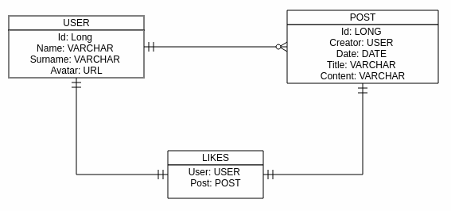

## Headbook

La empresa Headbook desea lanzar una nueva red social llamada 'Headbook'. En dicha red social, los usuarios serán capaces de publicar noticias y eventos.

Para ello, durante la fase de análisis se plantea el siguiente diagrama E-R para la aplicación:

Habrá que modela una aplicación que responda a la siguiente funcionalidad:

- La página principal será un listado de `posts` ordenado por fecha (desc)
- De cada post habrá que mostrar el `usuario`, el `título` del post y los primeros 50 carácteres del contenido, así como el número de likes que tiene el post
- Existirá una página de detalle del `post`, donde se visualize el contenido completo del `post`
- Existirá un botón desde el que se pueda hacer like del `post`
- Así mismo, habrá que proporcionar una página para poder crear nuevos `post`

