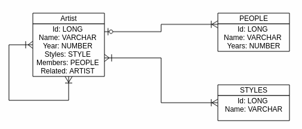

## Music collection

La empresa Musify desea realizar una aplicación que gestione su BD de artistas

Para ello, durante la fase de análisis se plantea el siguiente diagrama E-R para la aplicación:

Habrá que modela una aplicación que responda a la siguiente funcionalidad:

- Listado de artistas
- Dar de alta un nuevo artista
- Dar de alta `gente` en el sistema
- Asignar `gente` a los artistas
- Gestionar los artistas **relacionados** (añadir, visualizar, eliminar... )
- Mostrar artistas por `estilo`
