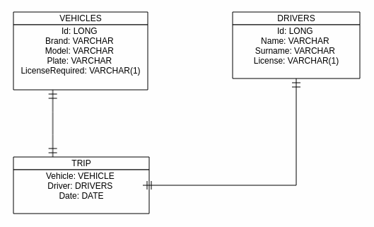

## UTER

La empresa Uster desea realizar una aplicación que gestione la reserva de vehículos por parte de los clientes

Para ello, durante la fase de análisis se plantea el siguiente diagrama E-R para la aplicación:

Habrá que modela una aplicación que responda a la siguiente funcionalidad:

- CRUD de `vehículos`
- CRUD de `conductores`
- Listado de `viajes` realizados
- Gestión de un nuevo viaje. Para ello, habrá que tener en cuenta:
    - Debe ser un proceso en 3 fase: selección de fecha, selección de vehículo, selección de conductor.
    - En la fase de selección de vehículo, sólo se podrán reservar aquellos que **no tengan ya un viaje programado ese día**
    - En la fase de selección de conductor, sólo se podrá seleccionar un conductor que **no tenga un viaje programado ese día Y que tenga la misma licencia que el vehículo seleccionado**.
