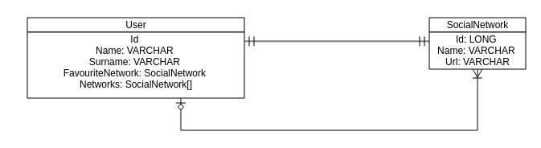

# Examen Java
La empresa SocialRich ha recibido el encargo de diseñar una aplicación para controlar las redes sociales de sus usuarios "influyentes".

Para ello, durante la fase de análisis se plantea el siguiente diagrama E-R para la aplicación:

Habrá que modela una aplicación que responda a los siguientes servicios:

 Verbo | URL | Descripción
 ----- | ----| ---------
GET | /users/ | Listado de usuarios completo
POST | /users/ | Alta de un nuevo usuario
GET | /users/:id | Devuelve el usuario identificado por `id`
GET | /users/:id/networks | Devuelve las redes sociales del usuario
POST | /users/:id/networks | Inserta una nueva red social
POST | /users/:id/fav | Establece la Red favorita

Además, existen las siguientes restricciones:

- Al dar de alta la primera red social, esta se convertirá automáticamente en favorita
- Es posible dar de alta un usuario sin redes sociales, pero es **obligatorio** que tenga al menos `name` y `surname`
- Una red social NO se puede crear si no se aportan ambos datos (`name` y `url`)
- Es posible devovler la red social favorita al obtener los datos del usuario, pero NO ES CORRECTO devolver todas las redes, para ello ya existe el método `GET /users/:id/networks`

Habrá de entregarse el código del proyecto completo de manera que ejecute y levante correctamente.

Puntos extras:

- Generar los test de la aplicación
- Aplicar correctamente el diseño por capas
- Un correcto manejo de errores